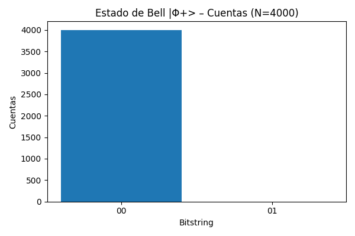

# ⚛️ Quantum Coding – First Experiment

This project contains my **first hands-on experiment in Quantum Computing** using [Pulser](https://github.com/pasqal-io/Pulser) and Azure Quantum.

---

## 🧩 Bell State Simulation – Quantum Entanglement

In this experiment, I built and simulated a   
 **Bell state (|Φ+⟩)**   using two qubits.  
Bell states are maximally entangled quantum states and a cornerstone of quantum information science.  

## 📖 Description

- **Pulser** is an open-source framework created by [Pasqal](https://pasqal.com) to design and simulate pulse sequences in **neutral atom architectures**.
- Here, we build a simple quantum circuit that approximates a Bell state:

\[
|\Phi^+\rangle = \frac{|00\rangle + |11\rangle}{\sqrt{2}}
\]

---
## 🧪 Steps
1. **Define 2 qubits** in a spatial register.  
2. **Declare channels**: one global (affects all qubits) and one local (affects only one qubit).  
3. Apply pulse sequences that mimic quantum gates:
   - π/2 global ≈ Hadamard on both qubits.  
   - Local 2π pulse on `q1` ≈ CZ gate (introduces a conditional phase).  
   - Another π/2 global pulse.  
4. **Emulate with `QutipEmulator`** to obtain probabilistic outcomes.  
5. **Visualize the results** using `matplotlib`.  

### 📊 Results
The measurement distribution shows only two outcomes:  
- **00 (~50%)**  
- **11 (~50%)**

This confirms the **entanglement**: both qubits are perfectly correlated.
Running:

```bash
python pulser_bell.py
````
1. Counts (measurement frequencies)

2. Probabilities

👉 In an ideal Bell state, we expect ≈50% in |00⟩ and ≈50% in |11⟩.
This demonstrates entanglement: the two qubits are no longer independent but correlated.



---
## 🚀 How to Run
```bash
# Activate your environment
source .venv311/bin/activate
````
```bash
# Install dependencies
pip install pulser pulser-simulation matplotlib
````
```bash
# Run demo
python pulser_bell.py
```
---
## 🚀 Technologies

Python 3.11

Pulser
 (core + simulation)

QuTiP
 (Quantum Toolbox in Python)

Matplotlib

---
## 📌 Next steps

Test the same experiment on Azure Quantum emulators (Pasqal).

Explore more quantum gates and basic algorithms (Grover, Deutsch–Jozsa, etc.).

Compare local simulation vs. running on real hardware when available.
## 🌌 Why it matters?
- Demonstrates **quantum superposition** and **entanglement**.  
- Basis for advanced protocols:
  - Quantum teleportation 🛰️  
  - Quantum cryptography 🔒  
  - Bell inequality experiments 📈  

✅ This was my **first quantum coding experiment**. Even a small program shows fundamental quantum effects!